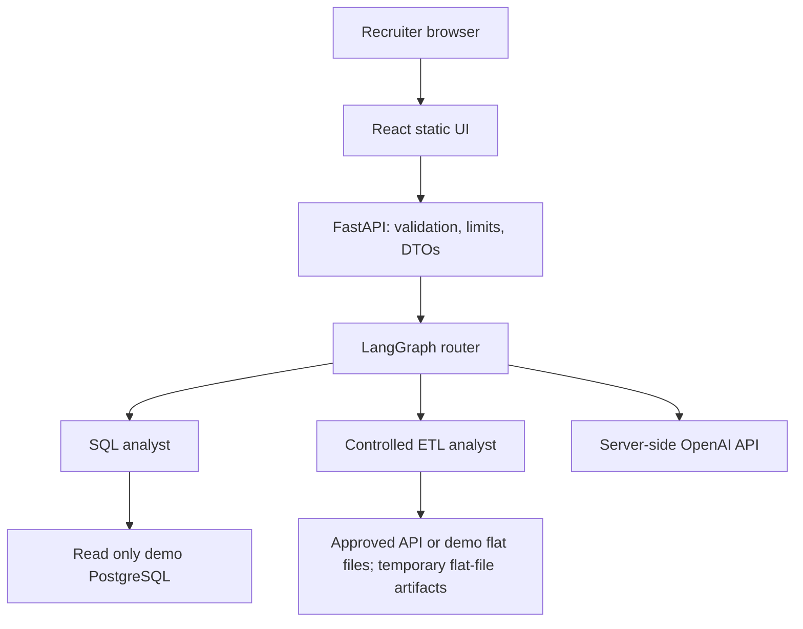

# AI Data Agent: UI and Hobby Deployment Plan

**Prepared:** 23 September 2026  
**Basis:** uploaded `AI_Data_Agent.zip`, `CODEBASE_FILE_GUIDE.md`, `LLM_UI_HANDOFF.md`, and the three agent graphs. This is an implementation plan; the attached project was inspected, not modified or run.  
**Goal:** a recruiter can open a public URL, try a few meaningful data questions and controlled ETL operations, inspect how the agents worked, and find the code and architecture in the README.

## 1. Decision and scope

Build a responsive React + TypeScript UI backed by a small FastAPI application. Keep the existing LangGraph router and SQL/ETL branches, but put an explicit public-demo boundary around their capabilities. For the first public release:

- **SQL:** natural-language questions against a separate demo PostgreSQL database, using a database account with SELECT access only. Show the answer, optional SQL, and structured rows.
- **ETL:** extract from a server-defined public API source or bundled flat-file fixture, transform with validated deterministic operations, and **load only to flat files** (`.csv`, newline-delimited `.json`, or `.parquet`) in a request-specific artifact directory. The agent may select a named source, operation, and allowed format; the tool owns the URL and paths. Return a preview and download. ETL never writes to Neon or any other database. No arbitrary Python execution or visitor-supplied URLs in the public service.
- **Conversation:** a chat-like timeline in the browser. Treat each submitted prompt as an independent graph invocation at first. Do not imply conversational memory; display a “Each request is independent” note and a reset action.
- **Portfolio:** a short overview of the router and subgraphs, example prompts, a link to source, a demo-data notice, and clear limitations.

**Suggested deployment:** React static site on Render Static Sites, FastAPI on a Render Free web service, and a separate Neon demo database. Render documents free static sites, a free web-service tier that sleeps after 15 minutes of inactivity, and ephemeral web-service storage; Neon documents a Free plan with scale-to-zero compute. Verify current quotas and eligibility in each account before deployment. OpenAI API calls are metered separately; hosting on a free tier does not make inference free. [Render free-tier docs](https://render.com/docs/free), [Render static sites](https://render.com/docs/static-sites), [Neon pricing](https://neon.com/pricing), [OpenAI API pricing](https://openai.com/api/pricing/).

The diagrams supplied with the project show a router selecting `sql_node` or `etl_node`; SQL curates, generates, judges, executes, and summarizes; ETL loops between an LLM and tool calls. The UI should reflect these real branches, rather than imply features the code does not implement.

## 2. Findings that change the order of work

| Finding in uploaded code | Impact | Required change before a public URL |
| --- | --- | --- |
| `utils/database.py` creates a connection, inspects schema, and writes `test_schema_details.txt` at import time. | Server startup and even health checks can require database credentials and write to disk. | Move demo code under `if __name__ == "__main__"`; initialize connections per operation, close them, and make `/api/health` independent of DB/LLM. |
| `agents/data_agent.py` calls `draw_mermaid_png()` and writes a PNG at import time. | Starting an API can make a network-dependent graph rendering call and write a file. | Move graph export to a developer script or `__main__`. |
| `agents/sql_analyst.py` trusts an LLM `is_safe_sql` result; `utils/database.py` executes any query and commits. The prompt's ten-row limit is advisory. | A generated unsafe or expensive query can still execute. | Use a SELECT-only demo role, read-only transaction, server-side statement timeout and capped result size; parse/validate one SELECT statement and reject failures before execution. Keep the LLM judge as an explainable secondary signal. |
| `utils/etl_tools.py` uses `exec(code)`, permits agent-chosen paths, and fetches agent-chosen URLs with no explicit timeout or size limit. | Public visitors could run code, fetch internal URLs, overwrite shared files, or consume resources. | Replace public tools with named flat-file sources, one or more server-defined public API endpoints, and typed allowlisted transformations. Keep arbitrary URL extraction and generated-code transform disabled publicly; only revisit in an isolated worker with outbound-network and resource controls. |
| `extract_load` writes the fixed name `extracted_data.<format>`; files are local. | Requests overwrite each other; free-service restarts lose outputs. | Use unique per-request artifact IDs in a temporary directory, TTL cleanup, size caps, and no durability promise. Optionally use object storage later. |
| SQL state is appended as a nested dict in `DataAgentSchema.messages`, while ETL appends its nested state. | “Last message is assistant text” is false at the outer graph level. | Normalize each branch explicitly from its returned state; test actual `invoke()` shapes. Never serialize raw graph state to the browser. |
| `utils/llm_pick.py` hard-codes model IDs and `reasoning_effort="none"`; it calls ChatOpenAI even for `pick_llm("claude")`. | Model availability/configuration and cost can break deployment; README's Claude claims are outdated. | Configure tested OpenAI model IDs by env var, verify access and supported parameters with the actual API account, set per-request token/cost controls; remove misleading provider claims. |
| README claims sandboxed code, guaranteed SQL protection, and an automatic row limit. The sample data has names, emails, phone numbers, locations and plates. | Recruiters would see inaccurate security claims; demo data may look personal. | Correct the README and confirm that every published row is synthetic and safe to show. Create a fresh demo database from reviewed fixtures. |
| `feed_db.py` truncates tables while seeding. | Re-running against the wrong database destroys data. | Add a demo-only target guard and explicit seed command; never run it on an existing personal/production DB or on startup. |

The handoff guide is a useful target design, but its proposed JSON shape and safety claims are not implemented yet. The source files above are the basis for sequencing.

## 3. Milestones in dependency order

### M0 — Repository and demo baseline

**Files:** `.gitignore`, `.env.example`, `pyproject.toml`, `requirements.txt` or `uv.lock`, `README.md`, `feed_db.py`, sample CSVs.

1. Make a clean working branch. Remove `.venv`, generated output, temporary editor files, and any local `.env` from the deployable repository/archive; inspect Git history for committed secrets and rotate any exposed keys/passwords.
2. Pick `pyproject.toml` + `uv.lock` as the dependency source of truth; add FastAPI, Uvicorn, the SQL parser chosen in M1, and test dependencies; generate a consistent deployment install command. Keep only one PostgreSQL driver distribution.
3. Review data fixtures for synthetic content and problematic free-text fields. Create a **separate** demo Neon database; seed it explicitly with a guarded script. Make a database role that has SELECT on the demo tables and no table modification rights.
4. Move import-time I/O out of `utils/database.py` and graph image generation out of `agents/data_agent.py`. Configure tested model IDs through environment variables. Run a local SQL query and controlled ETL operation as a baseline.

**Exit:** clean startup without database/network calls from imports; repeatable safe demo seed; no real secret or unreviewed personal data in deploy artifacts.

### M1 — Public execution boundary

**Files:** `utils/database.py`, `agents/sql_analyst.py`, `agents/etl_analyst.py`, `utils/etl_tools.py`, `utils/llm_pick.py`, new `services/` or equivalent.

1. At the SQL execution boundary, require exactly one parsed SELECT statement (including safe SELECT CTEs only), reject comments/multiple statements and non-SELECT constructs, apply a server-side row cap and `statement_timeout`, and use a read-only DB role **and** read-only transaction. Do not rely on the LLM judge or text matching as the enforcement layer. Return `columns` and JSON-safe `rows`, while preserving a bounded text form for the summarizing LLM if needed.
2. Replace the public ETL tools with typed operations over named demo datasets and server-defined API sources. Example `extract_pokemon(format: csv|json)`, `filter_ratings(min_rating: 0..5, format: csv|json)`, and `summarize_payments_by_method(format: csv|json)`. For extraction, map a source name to a fixed HTTPS endpoint on the server; reject redirects, use a request timeout and response-byte cap, validate the expected JSON shape, and cap output rows. The tool can fall back to a bundled fixture when the third-party API is unavailable, with an honest `fixture` source label. Agent tool arguments must be validated on the server. No client or model-chosen absolute paths, imports, Python source, URLs, or SQL strings. Keep broader experimental tools behind a local-only setting with a hard server-side gate; do not bind them into the public graph.
3. Treat “load” as writing a new flat-file artifact, not inserting/updating PostgreSQL. ETL modules and tool functions must not import the database utility, accept a DB connection, or receive DB credentials. In deployment, keep database write credentials only in a one-off seed environment; the runtime receives a SELECT-only role for SQL. The runtime SQL credential cannot write even if a future code path accidentally reaches the database.
4. Cap input length, returned rows, fetched/saved bytes, output file size, LLM calls and graph steps. Use unique artifact IDs and an allowlisted artifact root; delete expired files. Escape or plain-text render model output in the browser.
5. Add focused tests for unsafe generated SQL, disguised writes, multiple statements, timeouts, disallowed ETL inputs, invalid output formats, concurrent artifact naming, denied traversal, and API source failures. Assert ETL creates a flat-file output and makes no DB call. Use a real demo-role integration test to confirm write attempts fail at PostgreSQL.

**Exit:** untrusted prompts cannot make the service write to PostgreSQL, execute arbitrary Python, read/write arbitrary files, or fetch arbitrary URLs. The ETL graph extracts from an approved source, transforms approved data, and writes a downloadable flat file.

### M2 — Stable backend contract

**Files:** new `api.py` / `server.py`, `api_models.py`, `services/agent_adapter.py`, tests. See [UI and API contract](./AI_DATA_AGENT_UI_API_SPEC.md).

1. Add `POST /api/chat`, `GET /api/health`, and a token/ID-based artifact download endpoint. Use Pydantic request/response types; validate input and return bounded, sanitized errors.
2. Adapt the **actual** `data_agent.invoke({"messages": [HumanMessage(content=message)], "route_response": ""})` result. Dispatch based on `route_response`; extract SQL fields from the nested branch state or ETL's last assistant/tool result. Prefer a small explicit branch result object in graph state if this proves fragile.
3. Run synchronous graph work in a bounded worker pool; set a request deadline and cancellation behavior. A request timeout alone does not stop an already running Python worker, so prevent further work with graph/tool and database limits. Log request ID, branch, latency, error category and coarse token usage without secrets, prompt context or raw user data.
4. Add a readiness check separate from liveness if needed; keep liveness cheap. Lock CORS to the deployed frontend origin and the local development origin. Apply rate limits and an overall usage budget; use one running worker initially.

**Exit:** SQL answer, rejected SQL, successful ETL, validation error, upstream failure and missing artifact have stable JSON responses and focused API tests.

### M3 — Recruiter-facing UI

**Files:** new `frontend/` (Vite + React + TypeScript), API client, components and styles.

1. Build a clear header with project identity, architecture link and service status; a conversation area; prominent example prompts; a multiline composer with disabled/loading state; and a small note that requests are independent.
2. Render assistant answer plus SQL/ETL badge, structured result table with row cap, and downloadable ETL artifact. Put generated SQL, safety decision and operation metadata in a collapsed “How it worked” panel. Avoid exposing full prompts, schema samples, code or credentials.
3. Handle cold start (“Starting demo; this may take a moment”), long request progress, validation errors, unsafe SQL, rate limit, timeout, offline backend and expired artifact. Make the UI usable on mobile and by keyboard. A reset clears only browser state.
4. Build against mocked contract responses, then integrate with the live local API. Keep the API base URL in public frontend configuration; keep credentials only on the server.

**Exit:** a visitor can submit example SQL and ETL requests from desktop/mobile, read results and download a current artifact; all expected failures are understandable.

### M4 — Deploy and present

**Files:** deployment config, `README.md`, screenshots, optional CI workflow.

1. Create the separate Neon demo DB and least-privilege role; seed it intentionally once. Set `OPENAI_API_KEY`, DB connection values, tested model IDs, `FRONTEND_ORIGIN`, and limits in the Render backend service. Do not expose secrets as Vite public variables.
2. Deploy FastAPI as a Render Free web service with a command such as `uvicorn api:app --host 0.0.0.0 --port $PORT` (adjust module path to implementation). Deploy `frontend/` as a Render Static Site with the built output directory `dist`. Set the frontend API URL and backend CORS origin to the actual deployed URLs.
3. Smoke test SQL, blocked write request, approved API extraction, flat-file transformation, download, cold start, and failure states from the public UI. Verify that cross-origin requests work and that no local-only paths appear in responses.
4. Update README with a live demo link, 30-second walkthrough, graph diagrams/screenshots, precise safety boundaries, architecture, local setup, one-minute tradeoffs, and tests. Link the repo and demo on the résumé/LinkedIn only after the smoke test.

**Exit:** live URL and repo work in a private browser session; secrets stay server-side; README claims match the deployed behavior.

## 4. Delivery order and checkpoints

| Slice | Visible result | Gate |
| --- | --- | --- |
| 1. Safe SQL vertical slice | Local API answers one seeded DB question. | Read-only role, parser, row cap and failure tests pass. |
| 2. Controlled ETL slice | Local API extracts from one approved source, transforms named demo data, and returns flat-file downloads. | No database writes; arbitrary code/URL/path requests fail; unique files and expiry work. |
| 3. UI integration | Local browser demonstrates both branches. | DTOs and loading/error states match API. |
| 4. Public demo | Hosted URL, README and screenshots. | Public smoke checks and cost controls pass. |

This order produces a usable browser demo early while keeping public exposure as the last step. If a hosting quota or cold-start delay makes the live flow unreliable, keep a short recorded walkthrough or screenshots in the README as a companion, not as a substitute for the working demo.

## 5. Operating limits and later extensions

- **Cost:** set API project usage limits/alerts, choose an accessible small model for cheap routing and SQL summaries, cap calls per request, and throttle anonymous traffic. Verify model names and request parameters with the user's OpenAI account before choosing values. Provider-hosted inference has a variable cost.
- **Availability:** Render Free services sleep after idle time; display a cold-start message. Their filesystem is ephemeral; artifact links are temporary and may vanish on restart. Store durable files outside the web service if persistence becomes a requirement.
- **Data:** seed only synthetic data. SQL schema prompts currently include sample rows; exclude sensitive columns/values before sending schema context to the LLM or making the repo public.
- **Phase 2, if useful:** add more preapproved HTTPS API sources and validated transformations; persistent object storage for artifacts; stronger audit traces; streaming progress; true multi-turn memory with session isolation. A database-load capability would be a separate, non-public workflow with a dedicated restricted staging schema, separate write credential, fixed tables/columns, validation, quotas and human approval before promotion. Do not expand the anonymous ETL tool's database privileges merely by adding checks. Generated Python transformations would require a genuinely isolated execution service with no secrets, filesystem mounts or unrestricted network access. Do not turn on the present `exec()` path for anonymous users.

## 6. Decisions to finalize during implementation

1. Which public repo URL and project name should the UI/README use?
2. Is a short-lived artifact download enough for the portfolio, or is durable artifact history important? The first release assumes short-lived files.
3. Which OpenAI API models are accessible on the project's API account, and what monthly budget should the anonymous demo observe? The first release assumes configured model IDs and a conservative cap.

These choices do not block the safe local API and UI work.
