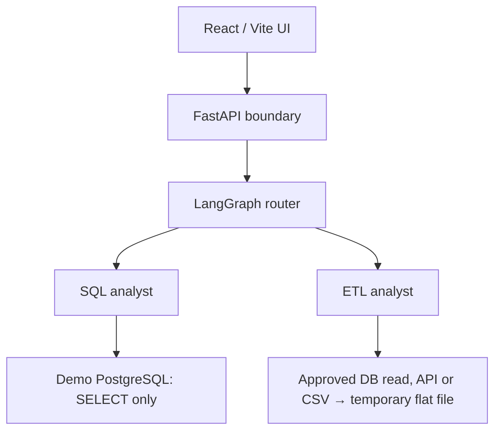

# Data Agent — SQL and flat-file ETL playground

A recruiter-facing demo of a LangGraph router with two specialist branches. The SQL analyst answers natural-language questions about a PostgreSQL demo dataset. The ETL analyst exports filtered demo database queries and public JSON/CSV URLs, and transforms bundled or exported datasets into **flat files only**. The React interface shows answers, structured rows, the selected route, and temporary downloads.

> This is a portfolio demo. Each prompt is an independent request; there is no conversation memory. The deployed agent has no database write credential. API inference can incur OpenAI charges.

## Architecture



The SQL branch uses the connected database's schema and bounded examples of stored values to interpret natural-language questions. Context is cached for five minutes. Filters can use any column in the five demo tables, including numeric, date, boolean, and text conditions. Text equality maps case and spacing variants to stored values, such as “credit card” → `credit_card`. Generic payment “card” includes credit and debit cards. Values absent from the sample are not assumed absent from the database.

Table lists, table counts, and schema requests use fixed catalog queries without model calls. Common row-count, fare, and payment questions retain fixed shortcuts. Other questions use model-generated SQL. Every query passes a deterministic SELECT validator and a read-only database transaction. The validator permits logical `AND`/`OR` conditions and approved functions, while rejecting writes, system/private tables, and cross-database references. The LLM judge logs an advisory decision; it does not override the deterministic boundary.

Database requests ending with “extract/export to CSV” use the same SQL graph, apply filters before the 500-row export cap, and write the result to a flat file. All columns in the synthetic demo tables can be explicitly selected or filtered. A plain “export users table” still uses the default curated field list. Singular and plural source names are recognized (payment/payments, ride/rides, user/users, vehicle/vehicles, rating/ratings). Filtering and exporting records cannot be replaced with a summary tool. The browser shows the query under “How it worked.” ETL has no database load operation.

Public HTTP/HTTPS URLs can supply UTF-8 JSON, JSON Lines, CSV, or TSV. The server validates all resolved IP addresses, connects to a validated address while preserving TLS hostname checks, and revalidates redirect destinations. Downloads are limited to 1 MB, three redirects, and a 20-second processing budget with three-second connect/read timeouts. Private, loopback, link-local, metadata, and IP translation targets are rejected. Credentials in URLs, custom ports, compressed downloads, HTML pages, and automatic pagination are unsupported.

An LLM produces a structured transformation plan over the loaded columns. A finite pandas executor supports filters, column selection/renaming, sorting, deduplication, null handling, type conversion, grouping/aggregation, and row limits. It does not execute generated Python. Transformations run over up to 5,000 input rows and 100 columns before a final 500-row file cap. Output formats are CSV, JSON Lines, and Parquet. When JSON has multiple record arrays, specify `records path: data.items` for the desired path. Spreadsheet formulas are escaped in CSV downloads; original values are retained for subsequent transformations.

## Try it locally

Requirements: Python 3.12+, Node.js, `uv`, a separate seeded demo PostgreSQL database, and an OpenAI API key with access to the configured models.

```bash
uv sync
cp .env.example .env
# Fill OPENAI_API_KEY and DB_* values in .env (or set environment variables).
uv run uvicorn api:app --reload --port 8000
```

In a second terminal:

```bash
cd frontend
npm ci
cp .env.example .env
npm run dev
```

Open `http://localhost:5173`. API documentation is at `http://localhost:8000/docs`; liveness is `GET /api/health`. Set `VITE_API_BASE_URL` for a different backend and optionally `VITE_SOURCE_URL` for your public repository link. Do not put secrets in a `VITE_` variable.

To debug a request, inspect the backend console (or deployment service logs) for the `Request ID` shown on a blocked card. Logs show the router choice, generated and normalized SQL, validator verdict/reason, LLM judge verdict/reason when used, execution row count, URL host/byte count, and planned transformation operations. URL query strings are not logged by the downloader. A rejected query also returns the validator's reason in the UI. SQL text may contain literals derived from a visitor's request, so restrict access to production logs and set an appropriate retention period. After changing the backend, redeploy or restart it; `GET /api/health` should return `"revision": "artifact-source-priority-7"`. If it does not, the frontend is still calling an older API.

Example prompts:

- “What is the average fare by ride status?”
- “Which tables are available in the DB now?”
- “How many tables are there in DB?”
- “How many tables are there?”
- “Show me the schema of each table.”
- “Show the schema of the rides table.”
- “Extract users table from the DB.” Then click “Filter active users” or “Count by province” on the export card and run the suggested request.
- “How many payments used each payment method?”
- “Filter payments by payment method of credit card.”
- “Filter payments by debit card.”
- “Filter payments by card.” (Includes credit and debit cards.)
- “Filter the demo ratings to ratings of at least 4.5 and export CSV.”
- “Extract the approved Pokémon API data to CSV.”

For any generated file, click **Use as transformation source**, or choose it in the composer selector. Then describe the operation on “this file,” for example:

- “Filter payments by payment method of PAYPAL and extract to CSV.”
- “Export rides where fare is greater than 50 and status is completed to CSV.”
- “Extract https://jsonplaceholder.typicode.com/todos, filter completed equals true, and save to CSV.”
- “Keep only id and title in this file, remove duplicates, and save as JSON.”
- “Group this file by payment_method and sum amount.”

The API creates an anonymous session when the UI opens the link. Each session lasts 15 minutes and is represented by an HttpOnly cookie; activity does not extend the fixed window. Artifacts are tagged with their session ID, cannot be downloaded or transformed from another session, and are deleted when the session expires. Reloading after expiry starts a new session. The API receives `source_artifact_id` for follow-up transformations. No artifact is sent by default. Select a file explicitly for transformations; **New session** clears that selection. The UI sends `source_mode: "artifact"` when a file is explicitly selected. That selection takes precedence over table words in follow-up filters. An explicit filename such as `from query_export.csv` also selects the file path; its name must match the selected artifact ID. Explicit database requests such as “from the database” override the UI selection. A bare artifact ID from an older client does not override a new database request. Missing, expired, or mismatched file sources produce an error without querying the database. Subsequent transformations operate on the exported rows, so a truncated export is not the full database or remote dataset. The UI labels limited extracts.

The public ETL graph never writes into Neon. Only the separate manual seed process writes the initial demo tables.

## Prepare the demo database

All columns of the five demo tables may be queried or exported. Use only synthetic data intended for public access, and review the CSVs before deployment. In the supplied `users.csv`, all email addresses use `example.com`, but review the other fields and free-text comments too. Create a **disposable database whose name includes `demo`**. The seeding script creates tables and truncates existing rows, so run it only against that database with a temporary owner/seed credential:

```bash
# DB_HOST, DB_PORT, DB_NAME, DB_USER, DB_PASSWORD must identify the disposable database.
ALLOW_DEMO_DB_RESET=YES DEMO_DB_NAME_CONFIRM="$DB_NAME" uv run python feed_db.py
```

On Windows PowerShell, set the two guard environment variables with `$env:ALLOW_DEMO_DB_RESET='YES'` and `$env:DEMO_DB_NAME_CONFIRM=$env:DB_NAME` before `uv run python feed_db.py`.

After seeding, create a **different** runtime login with only schema usage and SELECT on the five demo tables. For example, run the following as the database owner, choosing your own password and role name:

```sql
CREATE ROLE data_agent_viewer LOGIN PASSWORD '<strong-unique-password>';
GRANT CONNECT ON DATABASE data_agent_demo TO data_agent_viewer;
GRANT USAGE ON SCHEMA public TO data_agent_viewer;
GRANT SELECT ON public.users, public.vehicles, public.rides,
                public.payments, public.ratings TO data_agent_viewer;
```

Use the actual database name in the `GRANT CONNECT` statement. Put **only** the viewer login in the web service's `DB_USER` and `DB_PASSWORD`. The seed credential must never be present in the web service. Confirm as the viewer that a SELECT works and an UPDATE fails before going public.

## Configuration

| Variable | Purpose |
| --- | --- |
| `OPENAI_API_KEY` | Server-side model access. |
| `MODEL_FAST`, `MODEL_SQL`, `MODEL_ETL` | Configurable OpenAI model IDs; default `gpt-4.1-mini`. Verify access in your API account. |
| `DB_HOST`, `DB_PORT`, `DB_NAME`, `DB_USER`, `DB_PASSWORD` | Viewer connection to the separate demo database; TLS required. |
| `FRONTEND_ORIGIN` | Exact browser origin for CORS; localhost in development. |
| `REQUESTS_PER_HOUR` | Process-local per-client cap (default 20); add a host/edge limit for multiple instances. |
| `DATA_ARTIFACT_DIR` | Optional writable directory for temporary flat-file exports. |
| `VITE_API_BASE_URL`, `VITE_SOURCE_URL` | Public frontend configuration, set in the frontend build. |

The backend also accepts the original lowercase Neon environment names for local compatibility. The examples use the new `DB_*` names consistently.


## Verification

```bash
OPENAI_API_KEY=test-key uv run python -m pytest -q
cd frontend && npm run build
```

The tests mock LLM and network calls, execute generated filter SQL against sample payment rows in SQLite, download and inspect CSV results through FastAPI, and test parsing, transformation chains, artifact isolation, URL address validation, redirects, and size bounds. A live end-to-end test requires **your** OpenAI key and seeded demo database and has not been performed in this workspace.

## Limitations and next steps

- Database preview: 100 rows. Database and file exports: 500 rows. Public URL input: 1 MB, 5,000 rows, 100 columns. Inputs above source limits are rejected; outputs above the export limit are visibly truncated.
- Only the five configured demo tables can be queried. The model can still misunderstand ambiguous requests; inspect “How it worked” and the backend request logs.
- Remote import is limited to public tabular HTTP/HTTPS responses. It does not log in, crawl websites, follow pagination, or support every file format. Transformations must fit the documented structured operations.
- The host must allow direct public HTTP/HTTPS egress. The downloader intentionally does not use ambient proxy settings. For a public deployment, enforce private-network egress restrictions at the host as an additional boundary.
- Flat-file downloads expire after one hour and may disappear on a restart. The demo is stateless.
- For a future private database-load feature, use a separate staging schema, separate restricted write credential, fixed table/column mapping, validation and approval. Do not grant the public ETL graph write access.
- See `AI_DATA_AGENT_DEPLOYMENT_PLAN.md` and `AI_DATA_AGENT_UI_API_SPEC.md` for the broader task plan and response contract if they are copied alongside this repository.

## URL implementation references

- [OWASP SSRF prevention](https://cheatsheetseries.owasp.org/cheatsheets/Server_Side_Request_Forgery_Prevention_Cheat_Sheet.html): public address validation and redirect controls.
- [urllib3 custom SNI](https://urllib3.readthedocs.io/en/stable/advanced-usage.html#custom-sni-hostname): connecting to a pinned address while retaining hostname verification.
